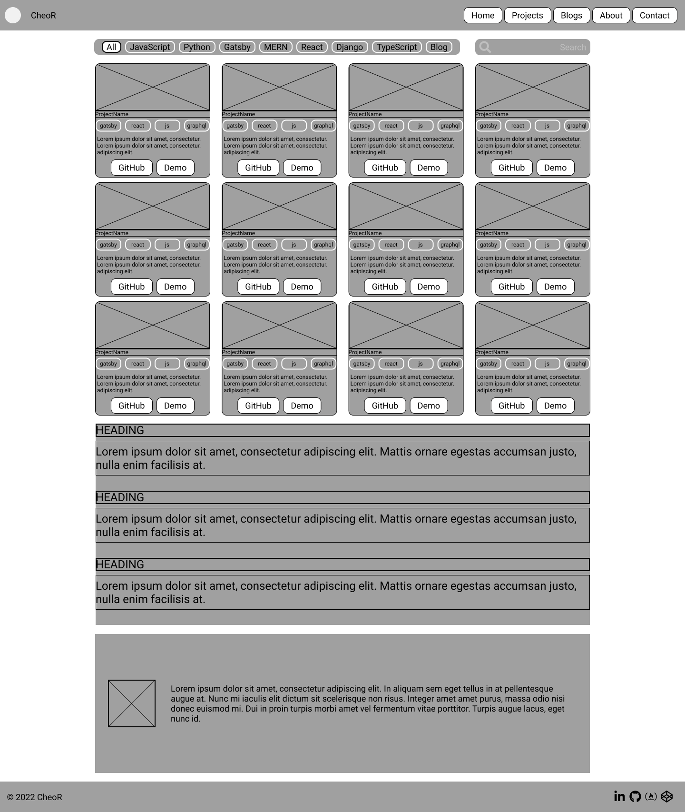

# Hi

My name's Cheo.

I'm a Nashville-based developer transitioning from a combined decade in the transportation/logistics/shipping industries to development. 

[Portfolio](https://cheor.github.io/portfolio/)

I'm planning redoing my portfolio with Gatsby.

# Wireframes

Desktop
<!--

-->

Tablet - landscape

